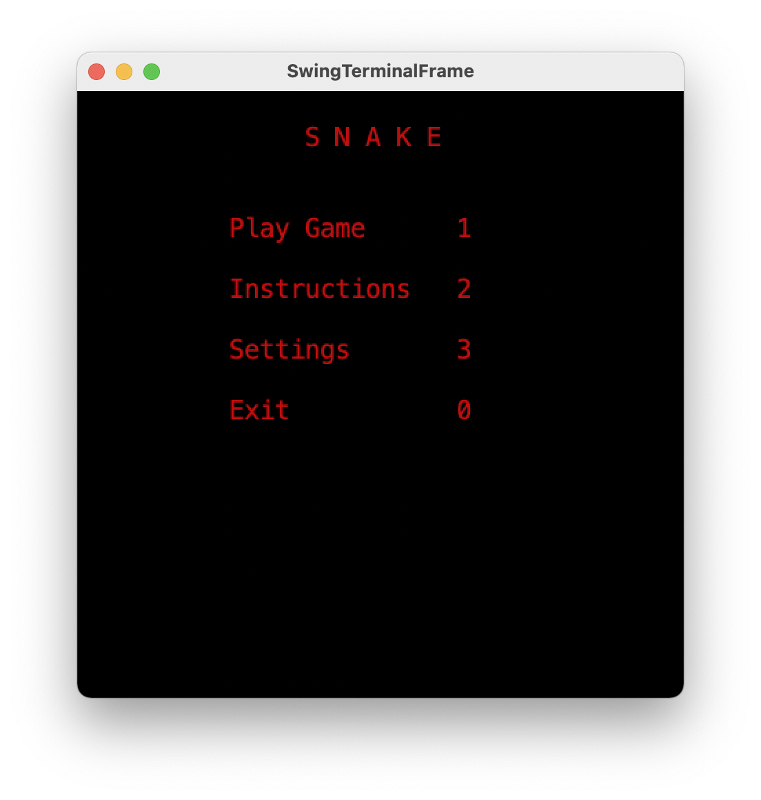
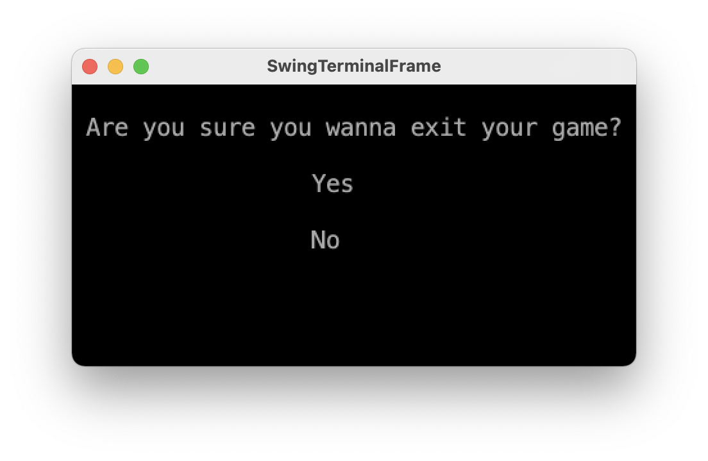

# LDTS_T2-G0203 - Snake Game

## Game Description

We made a classic snake game where you're able to grow your own snake. Your snake is able to move by itself and in order to grow it'll have to eat apples, that generate themselves all over your board. Though you have to be careful, if your snake hits itself she'll die and you'll have to start a new game. Our game also comes with graphics and some really nice sound effects.

## Screenshots

### snake.Menu:

### snake.Instructions:

### snake.Settings:

### snake.Gameplay:

### snake.PauseMenu:

### snake.GameOver:
